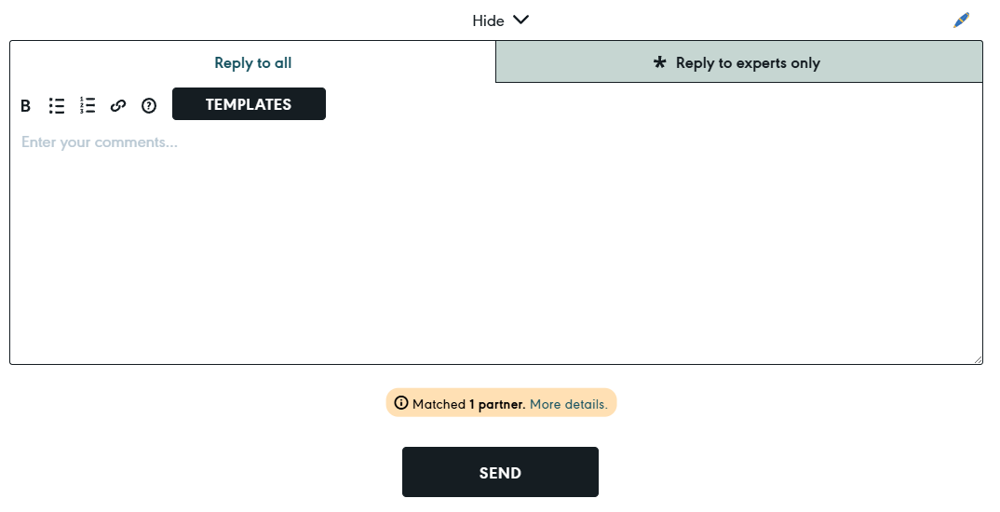
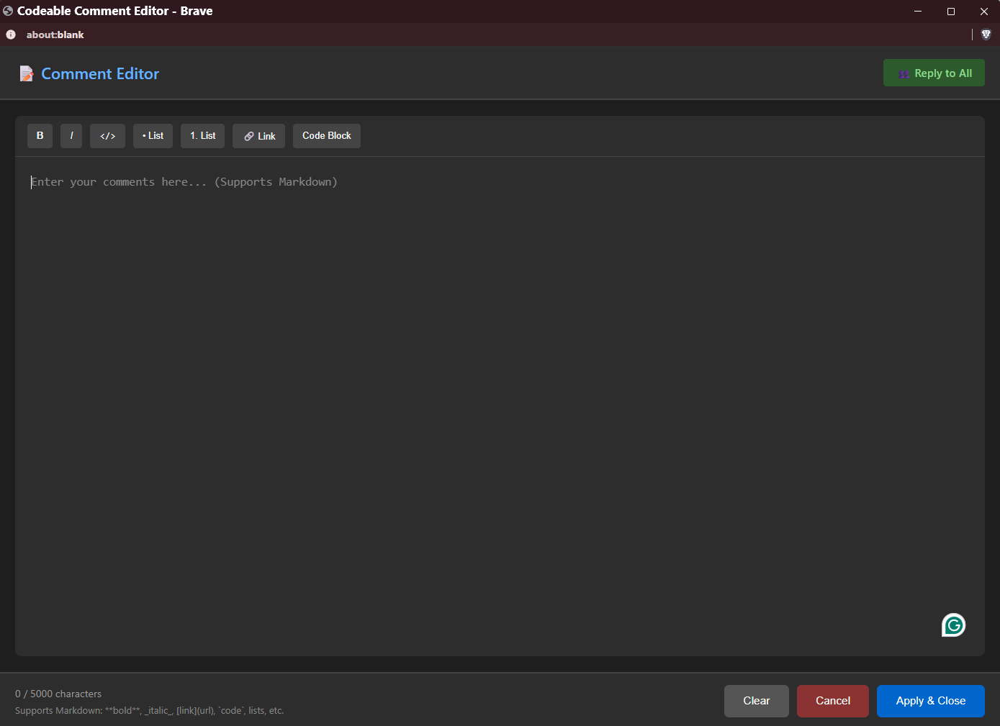

<!-- @format -->

# Codeable Comment Editor

A userscript that opens the Codeable comment textarea in a full-screen editor window for easier writing and formatting.

## Screenshots

_Click on the icon that will open the new comment window_

_Add your comments in new window and then apply to the platform comment area_

## Installation

1. **Install a userscript manager:**

   - For Chrome/Brave: Install [Tampermonkey](https://chrome.google.com/webstore/detail/tampermonkey/dhdgffkkebhmkfjojejmpbldmpobfkfo)
   - For Firefox: Install [Tampermonkey](https://addons.mozilla.org/en-US/firefox/addon/tampermonkey/) or [Greasemonkey](https://addons.mozilla.org/en-US/firefox/addon/greasemonkey/)

2. **Install the script:**

   - Open Tampermonkey dashboard (click the extension icon → Dashboard)
   - Click the "+" tab or "Create a new script"
   - Copy the entire content from `codeable-comment-editor.user.js`
   - Paste it and save (Ctrl+S or File → Save)

3. **Enable the script:**
   - Make sure the toggle next to the script name is ON/enabled

## Usage

1. Go to any Codeable project page: `https://app.codeable.io/projects/...`

2. Scroll to the comment section at the bottom

3. Look for the **🖊️** button in the comment form header (next to the lock icon)

4. Click the **🖊️** button to open the full-screen editor

5. Write your comment with markdown formatting using:

   - **Toolbar buttons** for formatting (Bold, Italic, Lists, Links, etc.)
   - **Keyboard shortcuts:**
     - `Ctrl/Cmd + Enter` - Apply & Close
     - `Ctrl/Cmd + B` - Bold
     - `Ctrl/Cmd + I` - Italic
     - `Ctrl/Cmd + K` - Insert Link

6. Click **"Apply & Close"** when done - your text will automatically be inserted into the main comment textarea

## Features

- Full-width/height editor window (1200x800)
- Dark theme matching Codeable's interface
- Markdown formatting toolbar
- Character counter (5000 max)
- Shows mode: "Reply to All" or "Experts Only"
- Prevents accidental closure with unsaved text
- Auto-applies text back to main textarea

## Troubleshooting

**Button not showing?**

- Open browser console (F12)
- Look for messages starting with 🖊️
- Make sure you're on a Codeable project page with a comment form
- Try refreshing the page

**Popup blocked?**

- Allow popups for `app.codeable.io` in your browser settings

**Text not applying back?**

- Check console for errors
- Try copying text manually from the editor
- Refresh the page and try again
